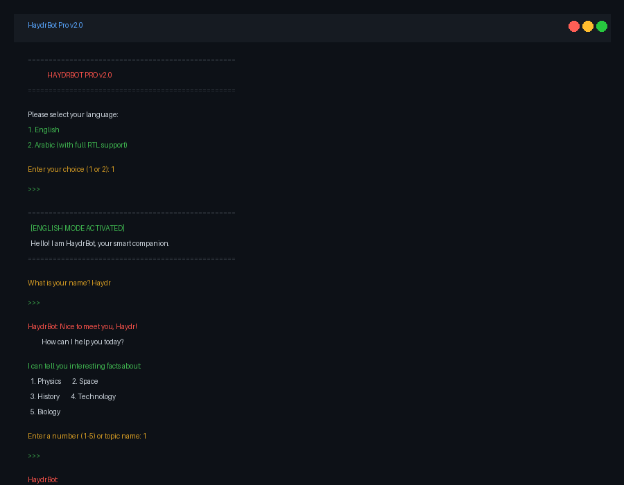

# 🤖 HaydrBot Pro v2.0

[](https://python.org)
[](LICENSE)
[](https://github.com/Haydr-Dev/haydr-bot)

> **Multilingual AI Chatbot with Smart Knowledge Base**  
> Built with Python | Supports English & Arabic | Features Spell Correction & Session Memory



---

## 🌍 Why I Built This

As a **Computer & Control Engineering graduate from Syria**, I wanted to create something that bridges language barriers and makes knowledge accessible to everyone — regardless of their technical background or native language.

This project demonstrates my skills in **Python, NLP, data structures, and user-centered design** — all aligned with **UNDP's mission of inclusive digitalization** and "leaving no one behind."

---

## ✨ Features

| Feature | Description |
|---------|-------------|
| 🌐 **Bilingual Support** | Full English and Arabic interface with RTL support |
| 🧠 **Smart Spell Correction** | Auto-corrects typos in both languages (e.g., "histry" → "history") |
| 📚 **Rich Knowledge Base** | 15 curated facts across 5 topics (Physics, Space, History, Technology, Biology) |
| 🎯 **Practical Examples** | Every fact includes real-world examples and applications |
| 🔄 **Session Memory** | Tracks shown facts to avoid repetition within a session |
| 👤 **Personalized** | Greets users by name and adapts responses |
| ⚡ **Zero Dependencies** | Runs on pure Python — no external libraries required |

---

## 🚀 Quick Start

```bash
# Clone the repository
git clone https://github.com/Haydr-Dev/haydr-bot.git
cd haydr-bot

# Run the bot
python haydr_bot.py
```

### Demo

```
==================================================
              HAYDRBOT PRO v2.0
==================================================

Please select your language:
1. English
2. العربية (Arabic)

Enter your choice (1 or 2): 1

✅ English selected!

==================================================
  Hello! I am HaydrBot, your smart companion.
==================================================

What is your name? Haydr

🤖 Nice to meet you, Haydr!

I can tell you interesting facts about:
  1. Physics
  2. Space
  3. History
  4. Technology
  5. Biology

Enter a number (1-5): 1

🤖 
💡 Einstein's General Relativity

Time is not constant! It moves slower when you travel at high speeds.

🎯 Example:
If you flew on a plane for one year, you would be 0.000053 seconds younger!

🔧 Application:
GPS satellites must adjust their clocks every day because time moves faster in orbit.

📚 (2 more fact(s) available about Einstein's General Relativity)
```

---

## 📚 Topics Covered

| # | Topic | Facts | Sample Title |
|---|-------|-------|--------------|
| 1 | 🔬 **Physics** | 3 | Quantum Gravity, General Relativity, Quantum Computing |
| 2 | 🚀 **Space** | 3 | Black Holes, Expanding Universe, Neutron Stars |
| 3 | 📜 **History** | 3 | Library of Alexandria, Sumerians, Antikythera Mechanism |
| 4 | 💻 **Technology** | 3 | Internet Origin, AI, Quantum Encryption |
| 5 | 🧬 **Biology** | 3 | DNA Storage, Human Microbiome, CRISPR |

---

## 🛠️ Technical Architecture

```
haydr_bot.py
├── Knowledge Base (Dictionary)
│   ├── English Facts (15)
│   └── Arabic Facts (15)
├── Spell Correction Engine
│   ├── English Corrections (30+)
│   └── Arabic Corrections (20+)
├── Response System
│   ├── Dynamic Greetings
│   ├── Context-Aware Replies
│   └── Session State Management
└── Main Loop
    ├── Language Selection
    ├── Name Input
    └── Topic Interaction
```

---

## 🎯 Skills Demonstrated

- **Python Programming** — Clean, modular code with OOP principles
- **Natural Language Processing** — Intent recognition and spell correction
- **Data Structures** — Efficient fact tracking and session management
- **User Experience** — Intuitive bilingual interface
- **Problem Solving** — Handling edge cases and invalid inputs
- **Version Control** — Git workflow and documentation

---

## 🔮 Future Enhancements

- [ ] 🎙️ **Voice Integration** — Speech-to-text and text-to-speech
- [ ] 🌐 **Web Interface** — Flask/FastAPI web app
- [ ] 🤖 **OpenAI API** — GPT-powered dynamic responses
- [ ] 📊 **Analytics Dashboard** — Track user interactions
- [ ] 🌍 **More Languages** — French, Spanish, Turkish

---

## 👨‍💻 About the Developer

**Haydr** — Computer & Control Engineering Graduate  
📍 Latakia, Syria | 🎓 Tishreen University  
🌐 [LinkedIn](https://linkedin.com/in/haydr-dev) | 💻 [GitHub](https://github.com/Haydr-Dev)

> *"Technology should be a bridge, not a barrier. Every line of code I write is a step toward making knowledge accessible to everyone."*

---

## 📄 License

This project is licensed under the MIT License — feel free to use, modify, and distribute.

---

<p align="center">
  <sub>Built with 💙 by Haydr | 2026</sub>
</p>
